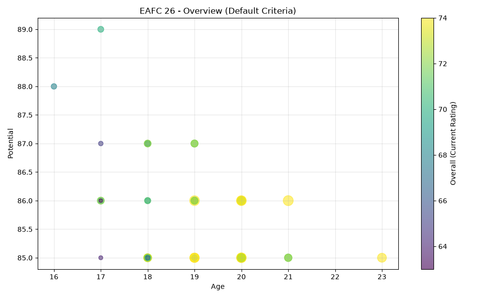
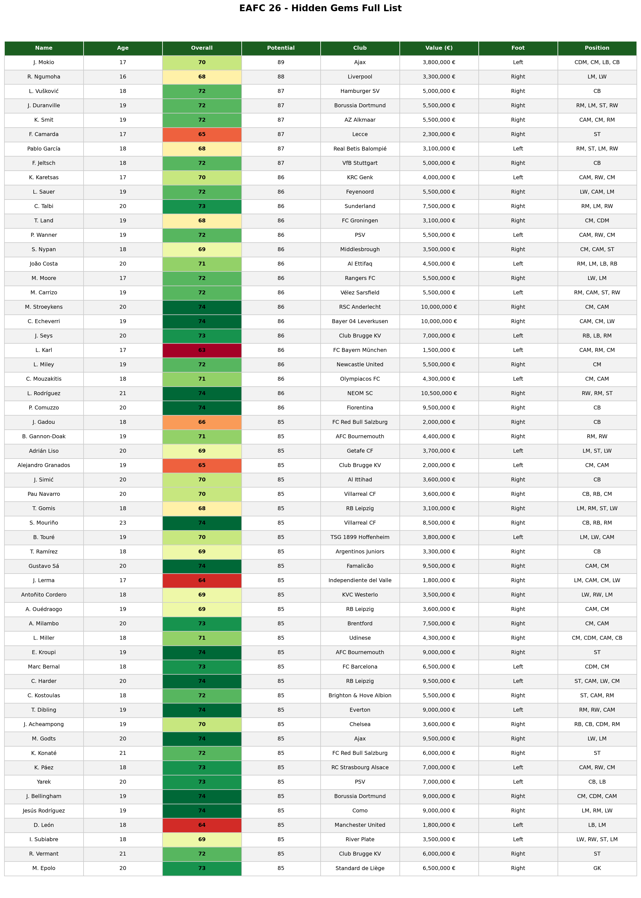
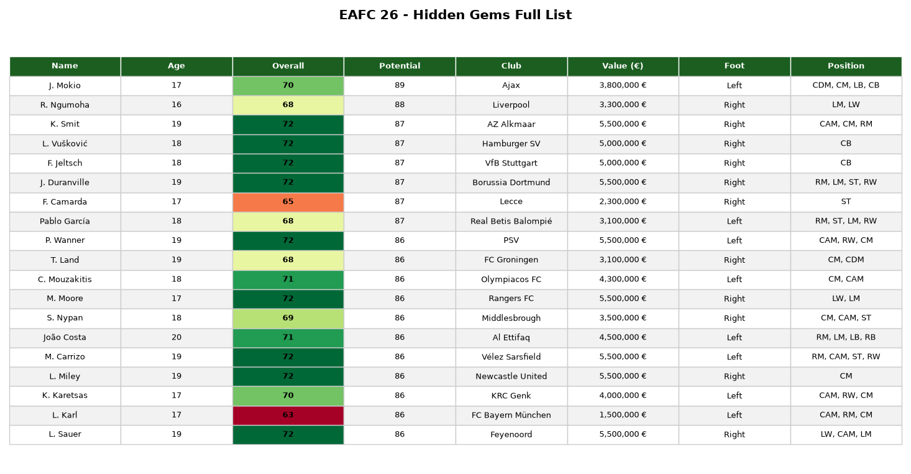

# EAFC 26 Scout Bot

A Python scouting tool that scans EAFC 26 player data with `pandas` to find undervalued young talents — **"hidden gems"** — based on age, current rating, and potential. Includes custom interactive filtering and Matplotlib visualizations (scatter plot + styled data table).

## What it does

Big clubs already know about the obvious wonderkids. This script digs through the full EAFC 26 player database to surface players who are:

- **Young** (age ≤ a chosen limit)
- **Currently underrated** (low overall rating)
- **High ceiling** (high potential rating)

...basically the kind of signings a smart, low-budget manager would go after in Career Mode.

## Features

- Loads and cleans a real-world Kaggle dataset (18,000+ players) with `pandas`
- Multi-condition filtering (age, overall, potential) using boolean indexing
- Interactive terminal prompt to build your own custom filter on top of the default one
- A scatter plot (age vs. potential, sized by market value, colored by overall) built with `matplotlib`
- A styled, color-coded, zebra-striped data table exported as a PNG

## Example Output

**Overview scatter plot** — age vs. potential, point size = market value, color = current rating:



**Hidden gems table** — full list using default criteria, color-coded by overall rating:



**Custom filter example** — same table, but narrowed down using the interactive prompt (e.g. minimum potential raised to 86):



## Data Source

This project uses the [FC 26 (FIFA 26) Player Data](https://www.kaggle.com/datasets/rovnez/fc-26-fifa-26-player-data) dataset from Kaggle, scraped from sofifa.com.

The CSV file is **not included** in this repository (large file, subject to the dataset's own license). To run this project:

1. Download the dataset from the link above
2. Save the CSV file in the project folder as `eafc26.csv`

## Installation

```bash
git clone https://github.com/YOUR_USERNAME/eafc26-scout-bot.git
cd eafc26-scout-bot
pip install -r requirements.txt
```

## Usage

```bash
python scout_bot.py
```

The script will:
1. Print an overview of hidden gems using default criteria (age ≤ 23, overall < 75, potential ≥ 85)
2. Show a scatter plot of the overview
3. Ask you to enter your own filter criteria in the terminal (press Enter to keep the default)
4. Print the custom filtered list and save a styled table image (`custom_filter_table.png`)

## Tech Stack

- Python 3
- pandas — data loading, cleaning, and filtering
- matplotlib — data visualization

## Possible Future Improvements

- Add a market value threshold as an optional filter
- Export results to CSV/Excel in addition to PNG
- Build a simple web UI (Streamlit) instead of terminal input

## Author

Built as a learning project while studying pandas and data visualization fundamentals.
